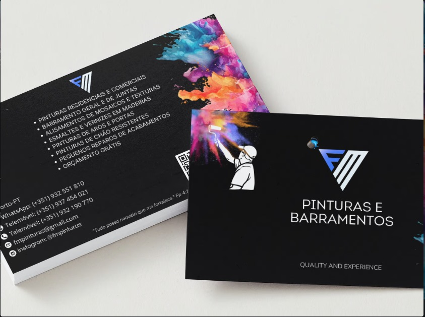
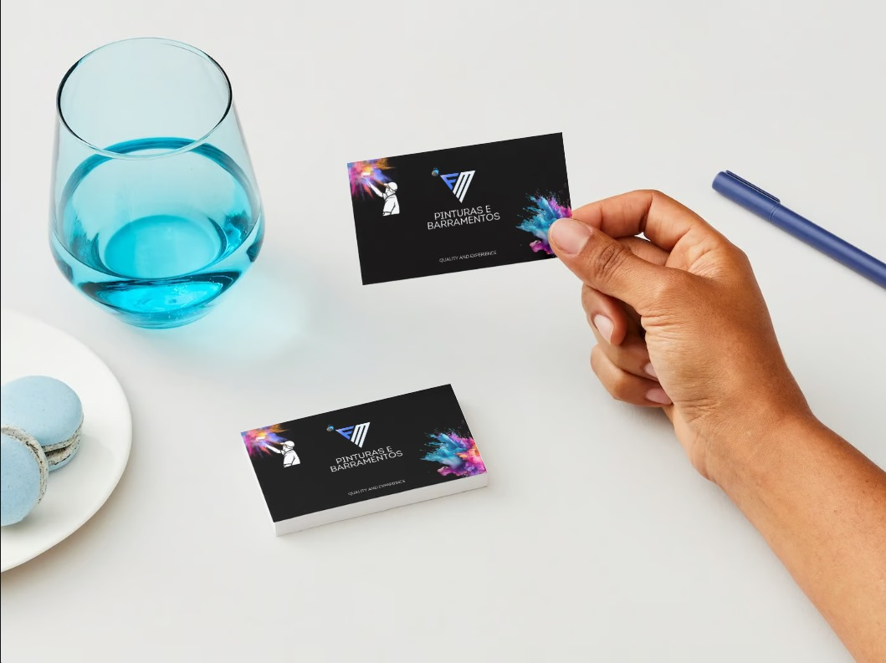
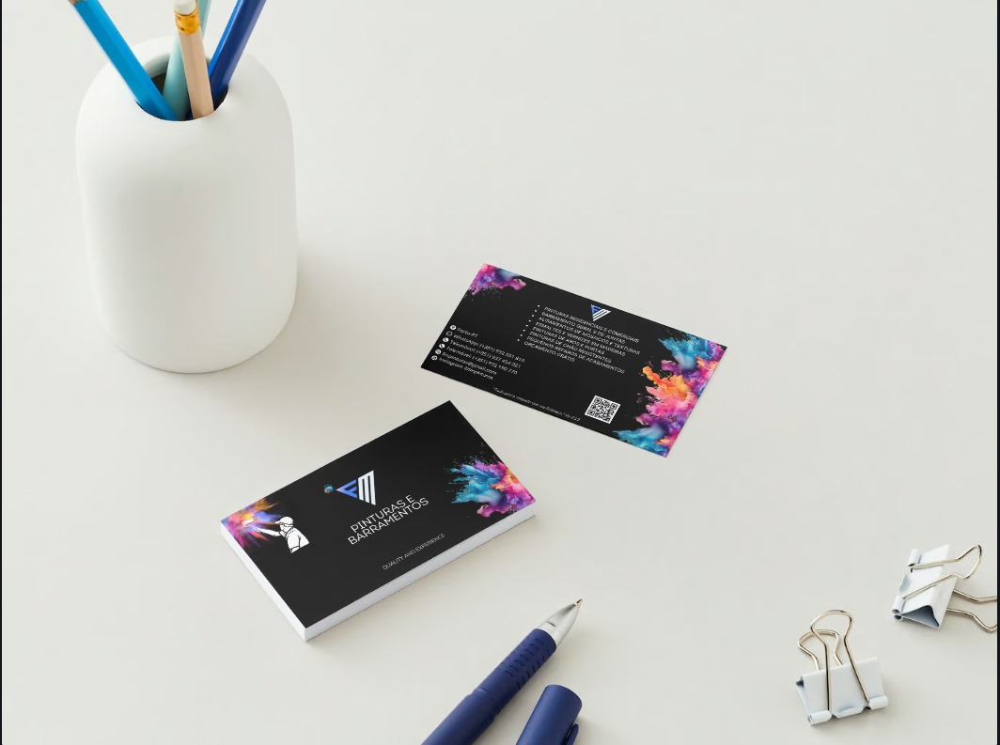
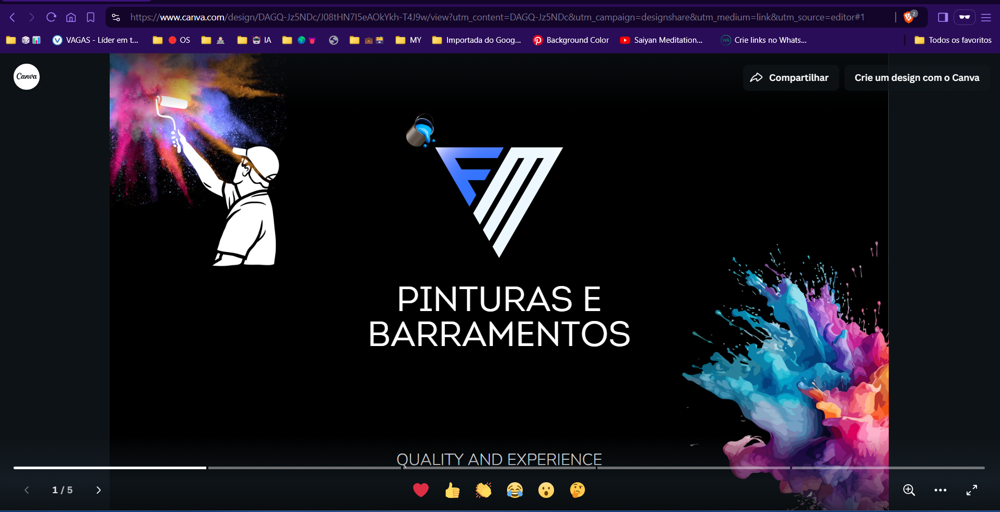
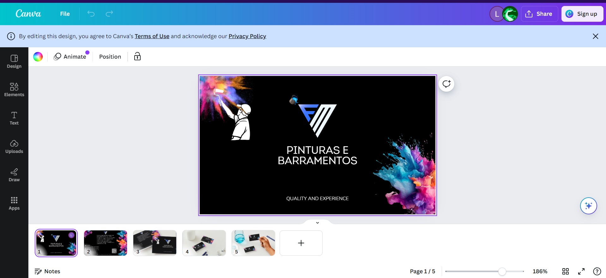

# Business Card Design

This repository showcases the process of creating a professional business card design for a client in Portugal. The project demonstrates both practical and technical skills applied from the initial layout creation to the final delivery.

## Overview

The project involved the creation of a custom business card design using a combination of design tools and techniques, ensuring alignment with the client's branding and vision. The process also included sharing preview links for printing and visualization.

## Project Highlights

- **Client Location**: Portugal
- **Design Tools Used**: Canva
- **Techniques**:
  - Use of geometric alignment for icons and text blocks.
  - QR code integration to modernize the design.
  - Incorporation of both Portuguese and English phrases for broader audience reach.
  - Alignment and spacing considerations to ensure clean and professional visuals.
  - Added a Bible verse at the client's request to reflect their values.

## Structure

The repository contains the following:

- **Asset Folder**: Contains all the background images, icons, and graphic elements used in the design.
- **Versions**: Tracks different versions of the card design throughout the development process.
- **Project Final**: Includes the final front and back designs.
- **README**: Documentation of the process and technical details.

## Versions

- **V1 to V5**: Different iterations of the card design showing changes based on client feedback and alignment improvements.

## Final Design

Below are previews of the final design:

### Front

### Back

## Mockups

To provide a more realistic experience for the client, mockups were created to visualize how the business card would look once printed. These mockups enhance the interactive aspect of the project by showing the card in real-world scenarios.

## Links

- **Shareable View-Only Link**: [View Link](https://www.canva.com/design/DAGQ-Jz5NDc/J08tHN7I5eAOkYkh-T4J9w/view?utm_content=DAGQ-Jz5NDc&utm_campaign=designshare&utm_medium=link&utm_source=editor#1)

- **Editable Link for Printing**:

## Conclusion

This project not only involved the design of a business card but also created a seamless experience for the client, ensuring that all elements were aligned and met the high standards of a professional design. The links provided enabled the client to easily share and print the final product.

---

# Design de Cartão de Visitas

Este repositório demonstra o processo de criação de um cartão de visitas profissional para um cliente em Portugal. O projeto demonstra tanto habilidades práticas quanto técnicas, desde a criação do layout inicial até a entrega final.

## Visão Geral

O projeto envolveu a criação de um design de cartão de visitas personalizado, utilizando uma combinação de ferramentas e técnicas de design, garantindo o alinhamento com a marca e visão do cliente. O processo também incluiu a partilha de links de visualização e impressão.

## Destaques do Projeto

- **Localização do Cliente**: Portugal
- **Ferramentas Usadas**: Canva
- **Técnicas**:
  - Alinhamento geométrico dos ícones e blocos de texto.
  - Integração de código QR para modernizar o design.
  - Incorporação de frases em português e inglês para ampliar o alcance do público.
  - Considerações de alinhamento e espaçamento para garantir uma aparência limpa e profissional.
  - Adição de um versículo bíblico a pedido do cliente para refletir seus valores.

## Estrutura

O repositório contém o seguinte:

- **Pasta de Assets**: Contém todas as imagens de fundo, ícones e elementos gráficos usados no design.
- **Versões**: Rastreia diferentes versões do design do cartão ao longo do processo de desenvolvimento.
- **Projeto Final**: Inclui os designs finais da frente e verso.
- **README**: Documentação do processo e detalhes técnicos.

## Versões

- **V1 a V5**: Diferentes iterações do design do cartão, mostrando mudanças com base no feedback do cliente e melhorias de alinhamento.

## Design Final

Abaixo estão as prévias do design final:

### Frente

### Verso

## Mockups

Para proporcionar ao cliente uma experiência visual ainda mais próxima da realidade, foram criados mockups representando como o cartão de visitas ficaria impresso e em uso. Esses mockups ajudam a visualizar o produto final em cenários reais, transmitindo profissionalismo e modernidade.

## Links

- **Link para Visualização Somente**: [Link de Visualização](https://www.canva.com/design/DAGQ-Jz5NDc/J08tHN7I5eAOkYkh-T4J9w/view?utm_content=DAGQ-Jz5NDc&utm_campaign=designshare&utm_medium=link&utm_source=editor#1)

- **Link para Edição**:

## Conclusão

Este projeto envolveu não apenas o design de um cartão de visitas, mas também criou uma experiência completa para o cliente, garantindo que todos os elementos estivessem alinhados e atendiam aos altos padrões de um design profissional. Os links fornecidos permitiram que o cliente compartilhasse e imprimisse facilmente o produto final.

---

_Projeto desenvolvido por Leonardo Alves da Cunha. Confira meus outros trabalhos no [GitHub](https://github.com/cunha-leo)._
